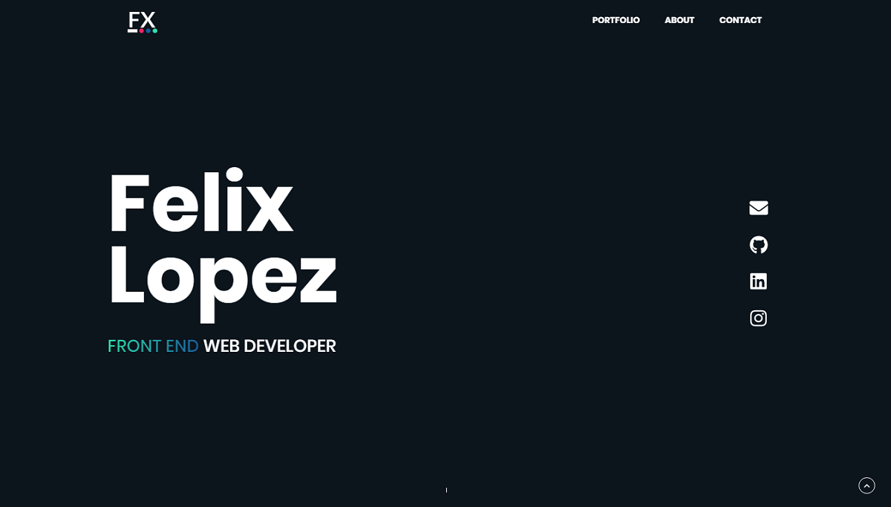

# Gatsby porfolio
This is my personal portfolio powered by gatsby an contenful



## Configuration and Installation

### Config
Add a `.env` file to the root folder with  `CONTENTFUL_ACCESS_TOKEN` , access token provided by the contentful API, also change the `spaceId` in `gatsby-config.js`

### install
```sh
  git clone https://github.com/felixlopz/gatsby-portfolio.git
  cd gatsby-portfolio
  npm install
  # make sure that you have installed windows build tools https://github.com/felixrieseberg/windows-build-tools
```

### Available commands
```sh
  gatsby develop #runs development server on http://localhost:8000/
  gatsby build #build your app
  # for more check package.json file
```
